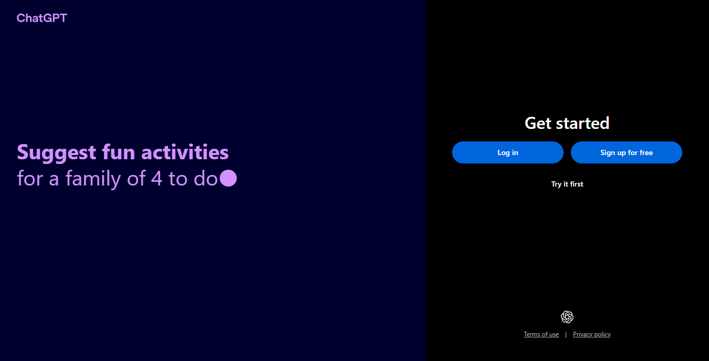
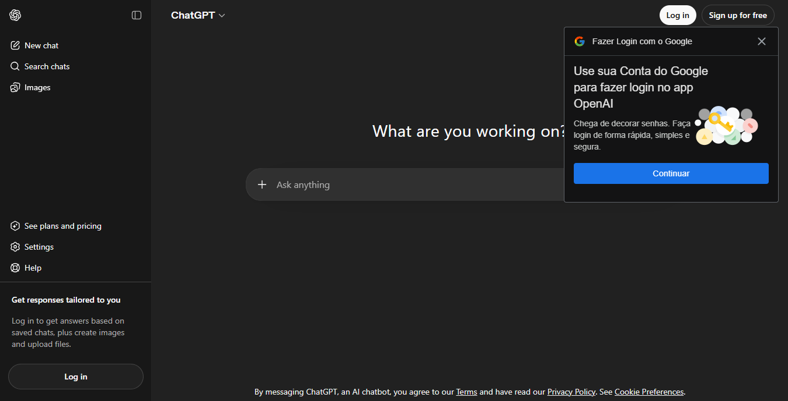
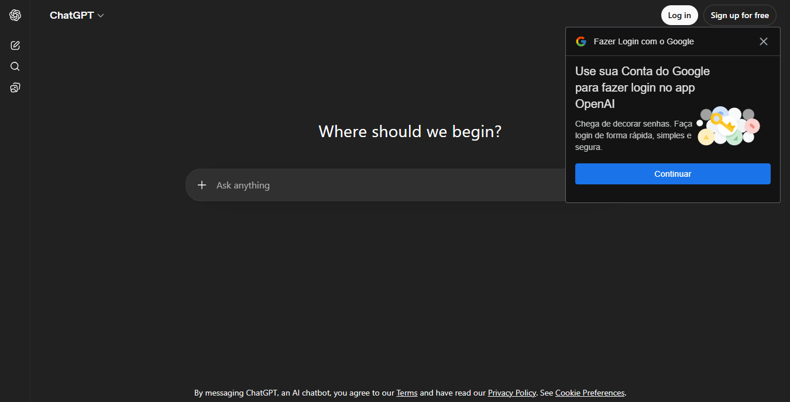
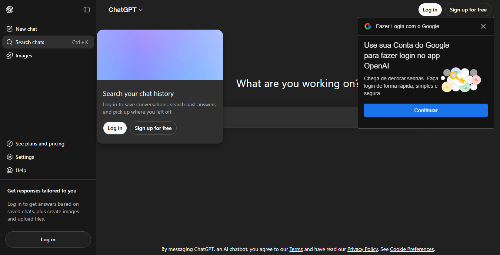
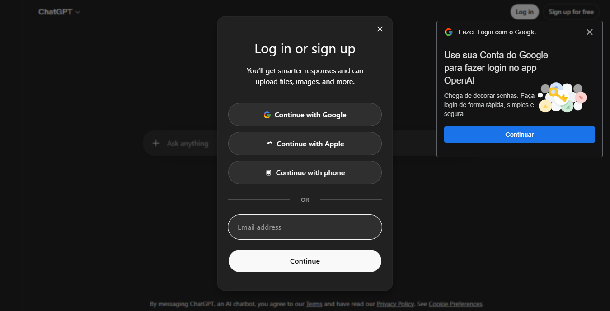
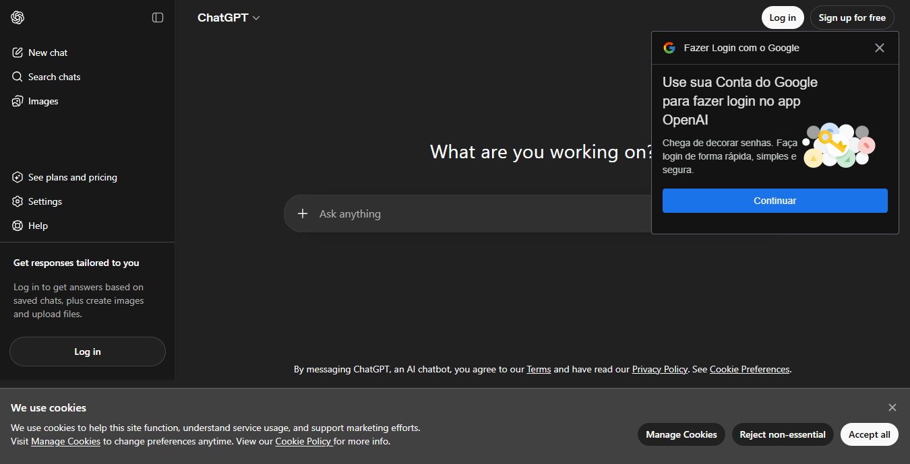
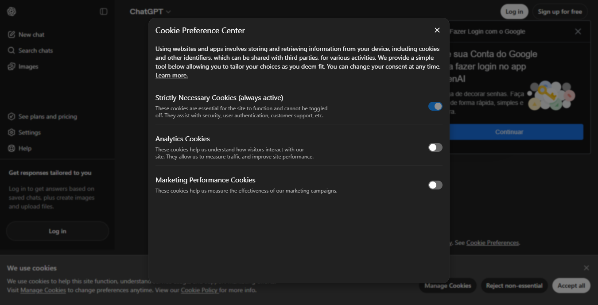
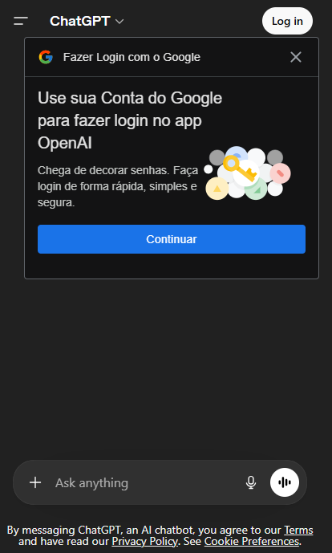

# ChatGPT Interface Electron

This project is an Electron-based ChatGPT-style desktop interface focused on product polish, session-aware UX, and authentication gating. The important point for a recruiter is not just that it renders a UI that looks familiar; it demonstrates how I translated a consumer-grade interaction model into a local desktop app with custom auth flows, cookie consent controls, protected navigation states, responsive behavior, and high-fidelity UI interactions.

Why that matters: this repo shows frontend execution beyond static cloning. It includes a working app shell, a custom “Matrix” session layer, Supabase authentication, cookie preference handling, responsive modals, hover-card tooltips, sidebar persistence, and desktop/mobile interaction behaviors that were implemented deliberately, not mocked superficially.

## What This Project Demonstrates

- Electron application shell with local HTTP serving instead of a fragile `file://` flow
- Custom authentication UX on top of Supabase, including Google OAuth and email-based flows
- A client-side session and access layer ("Matrix") that changes the product experience by user state
- Cookie consent UX with banner, preference center, persistence, and safe rehydration
- High-fidelity UI work: modals, tooltips, sidebar collapse, responsive states, drag-to-dismiss interactions, and guest-vs-authenticated navigation
- Recruiter-friendly product thinking: the code is not only functional, it is organized around user state, risk, and UX continuity

## Screenshots

Add or replace the images below with the latest captures stored in [`docs/screenshots`](./docs/screenshots).

### Desktop Login



### Desktop Chat Shell



### Sidebar Collapsed



### Search Chats Tooltip



### No-Auth Login Modal



### Cookie Banner



### Cookie Preference Center



### Mobile View



## Product Summary

The product behaves differently for guests and authenticated users, and that difference is intentional. Guests can browse the shell and see a credible onboarding experience, but restricted features stay hidden. Authenticated users unlock protected navigation states such as `Deep research` and `Health`, keep a longer-lived session, and carry provider metadata that can be reused by the UI.

That matters because it mirrors a real product problem: many interfaces are not simply “logged in” or “logged out.” They need a middle layer that decides what the user can see, what the app should persist, and what should happen after OAuth, email verification, or cookie resets. This project solves that explicitly.

## Architecture At A Glance

### Electron shell

The desktop application runs through Electron and serves the UI through a local HTTP origin instead of directly opening files. That choice matters because the authentication flow and cookie behavior are much more reliable on `http://127.0.0.1:3210` than on `file://`.

- Entry point: [`main.js`](./main.js)
- Secure bridge: [`preload.js`](./preload.js)
- App origin: `http://127.0.0.1:3210`

### Frontend pages

The app is organized as multiple HTML entry points, each mapped to a specific auth or product state.

- [`login.html`](./login.html): landing / onboarding shell
- [`log-in-or-create-account.html`](./log-in-or-create-account.html): email-or-provider entry
- [`create-account-password.html`](./create-account-password.html): password step
- [`email-verification.html`](./email-verification.html): OTP verification step
- [`auth/callback.html`](./auth/callback.html): Google OAuth completion step
- [`index.html`](./index.html): main authenticated/guest chat shell

### Frontend behavior modules

- [`src/js/matrix-session.js`](./src/js/matrix-session.js): session state, cookie mirroring, guest/auth transitions
- [`src/js/matrix-auth.js`](./src/js/matrix-auth.js): Supabase auth orchestration
- [`src/js/matrix-oauth-callback.js`](./src/js/matrix-oauth-callback.js): OAuth callback completion
- [`src/js/sidebar.js`](./src/js/sidebar.js): sidebar collapse/open behavior and persistence
- [`src/js/tooltip.js`](./src/js/tooltip.js): Radix-style tooltip and hover-card behavior

## What “Matrix” Means In This Project

“Matrix” in this repository is the client-side access and session layer. It is not the Matrix messaging protocol. It exists to answer a practical product question: what should the UI do for a guest, for an authenticated user, and for a user who is mid-authentication?

The Matrix layer matters because it prevents auth from being scattered across random components. Instead, one layer owns the session, mirrors the relevant state to cookies, tracks the auth provider, and exposes simple decisions to the UI.

It handles:

- guest session creation
- authenticated session creation
- pending auth state between pages
- role-based UI gating
- auth provider tracking (`google` vs `email`)
- cookie/session reconciliation when cookies are cleared

### Session model

The primary session object is stored in `localStorage` and mirrored into cookies when appropriate.

- Storage key: `matrix.session.v1`
- Pending auth key: `matrix.pending.v1`

Core session fields:

- `role`
- `gate`
- `email`
- `authProvider`
- `userId`
- `createdAt`
- `expiresAt`

### Session states

- `guest`: limited but usable shell access
- `authenticated`: access to protected UI, provider-aware state, longer TTL

### Why this design matters

This design improves UX and maintainability at the same time. The UI can ask a simple question such as “is the user authenticated?” or “which provider did they use?” without re-deriving that state from the page or from Supabase on every render.

## Cookie Model

Cookies in this project are not cosmetic. They support three different product needs: session mirroring, consent persistence, and sidebar state continuity.

### Session cookies

Session cookies mirror the Matrix session so the UI can rehydrate quickly and detect mismatches when cookies are removed.

- `matrix_role`
- `matrix_gate`
- `matrix_email`
- `matrix_auth_provider`

Why this matters: if a user clears cookies, the project reconciles that change and clears stale local session data instead of pretending the user is still authenticated.

### Consent cookies

Cookie consent is treated as product state, not as a dead banner.

- `matrix_cookie_consent`
- `matrix_cookie_preferences` (stored in localStorage)

The implementation includes:

- bottom banner
- preference center modal
- accept / reject / manage states
- persistent preferences
- inline and button-based entry points into the preference center

### UI persistence cookie

Sidebar state is also persisted because shell continuity matters in desktop apps.

- `stage_slideover_sidebar_state`

That persistence keeps the app from feeling stateless every time the user changes page or reloads the interface.

## Authentication Flows

### Google OAuth

The Google flow uses Supabase with PKCE and completes through a dedicated callback page.

Flow:

1. user chooses Google
2. the app starts OAuth through Supabase
3. Supabase returns to [`auth/callback.html`](./auth/callback.html)
4. the callback script finalizes auth
5. Matrix starts an authenticated session with `authProvider: google`
6. the app redirects into the main shell

Why that matters: the flow is product-complete. It does not stop at “open provider popup.” It lands back in the app with provider-aware state.

### Email flow

The email flow supports multi-step progression:

1. collect email
2. send OTP for signup or request password for login
3. verify the OTP when required
4. create or use password
5. start an authenticated Matrix session with `authProvider: email`

This matters because it shows form-state continuity across separate pages, not just a single-screen mock.

## Guest vs Authenticated Experience

The shell changes by role. That is deliberate product gating.

Authenticated-only examples in the sidebar:

- `Deep research`
- `Health`

Guests do not see those entries. Authenticated users do. The state is controlled centrally rather than hidden ad hoc in markup, which makes the behavior easier to reason about and harder to break.

## UI/UX Work Worth Reviewing

If you are reviewing this project for frontend or product-engineering ability, these are the highest-signal areas.

### Custom Google card

The project includes a hand-built Google-style sign-in card with visual fidelity work, provider-aware behavior, and post-auth disappearance when the user session becomes authenticated.

### No-auth login modal

The no-auth modal is more than a static overlay. It supports:

- top-right entry points
- sidebar login entry
- Search Chats tooltip entry
- sidebar auto-collapse before modal open
- drag-to-dismiss in multiple directions
- desktop and mobile gesture support
- gesture continuation after pointer release
- controlled close rules to avoid accidental cancellation

That matters because modal behavior is a strong proxy for real frontend craftsmanship. Small details compound quickly.

### Search Chats hover-card

The `Search chats` tooltip is a richer hover-card that:

- appears only in the right context
- opens a login/signup path
- reuses the central no-auth modal instead of branching into a separate UI path
- preserves sidebar state logic

### Cookie preference center

The cookie system includes both a visible banner and an in-place modal preference center, instead of redirecting users away from the workflow. That is a better UX decision and a better reflection of real product constraints.

### Sidebar behavior

The sidebar supports:

- expanded state
- collapsed rail
- mobile open/close state
- keyboard shortcuts
- cookie/localStorage persistence

This matters because navigation state is part of the product experience, not just a layout concern.

## Running The Project Locally

### Requirements

- Node.js
- npm

### Install

```bash
npm install
```

### Start the Electron app

```bash
npm start
```

### Build a Windows package

```bash
npm run dist:win
```

## Project Structure

```text
.
├── auth/
│   └── callback.html
├── build/
├── cdn/
│   └── assets/
├── src/
│   ├── css/
│   └── js/
├── index.html
├── login.html
├── log-in-or-create-account.html
├── create-account-password.html
├── email-verification.html
├── main.js
├── preload.js
└── package.json
```

## What A Recruiter Should Take Away

The main conclusion is simple: this project is evidence of product-minded frontend engineering, not just HTML reproduction. The strongest signal is the combination of UI fidelity, state orchestration, authentication continuity, and interaction detail.

More specifically, it shows that I can:

- turn a complex interface into a working desktop application
- design a usable state model instead of hardcoding view fragments
- bridge auth, cookies, modals, and navigation into a coherent UX
- implement polished interaction details on both desktop and mobile
- structure the result so it remains understandable and extensible

If you want to evaluate practical skill quickly, review:

1. [`src/js/matrix-session.js`](./src/js/matrix-session.js)
2. [`src/js/matrix-auth.js`](./src/js/matrix-auth.js)
3. [`src/js/sidebar.js`](./src/js/sidebar.js)
4. [`src/js/tooltip.js`](./src/js/tooltip.js)
5. [`index.html`](./index.html)

Those files contain most of the state, interaction, and product logic that differentiate this repo from a simple static clone.
